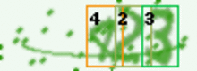
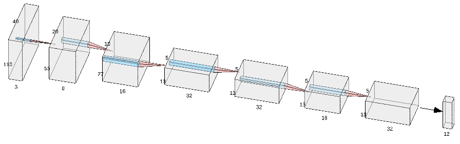

# Captcha recognition with Deep learning

## Architecture

CNN architecture inspired by yolo9000, but far less complicated.

Network predict 13x12 vector.
Each row correspond to one of 13 detectors.
Each detector provide:
* [0] Confidence of detector
* [1:10] One-hot encoded digit
* [11] Offset of digit from center of current detector

Achived accuracy for 3 digits: ~99%.

## Acknowledgments

Network topology visualized by http://alexlenail.me/NN-SVG

Captcha based on python captcha module https://github.com/lepture/captcha. Original captcha module was modified to generate ground truth data.

Yolo9000 https://pjreddie.com/publications/yolo9000/
